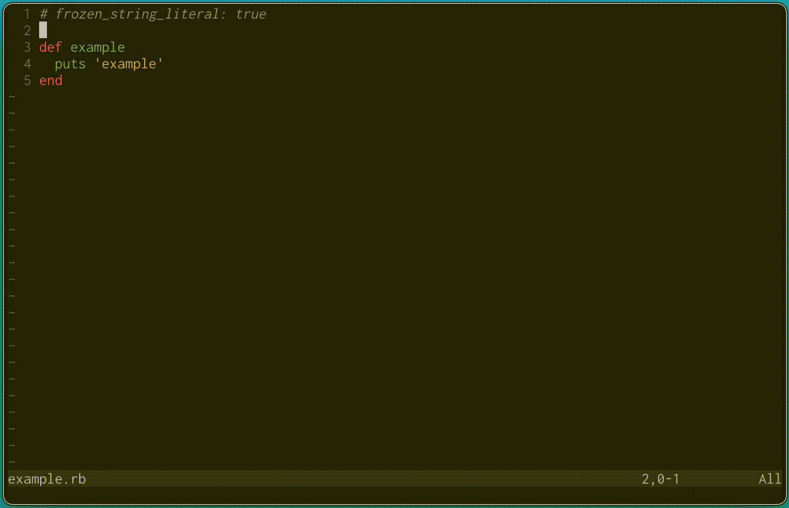

# telescope-lusty.nvim

A [Telescope](https://github.com/nvim-telescope/telescope.nvim) configuration for
quickly switching buffers using the home row keys. Inspired by
[Lusty Juggler](https://www.vim.org/scripts/script.php?script_id=2050)

## Features



Quickly switch between buffers using the home row keys (`asdfghjkl;'`). The
default configuration shows a minimal list in most-recently-used order

You can use the same key mappings in other Telescope pickers too.

Since `j` and `k` are used for quick navigation and some lists have more than
11 elements, you can use `Ctrl-j` and `Ctrl-k` (or `Ctrl-n` and `Ctrl-p` if you
prefer) to move up/down the list.

## Installation

Use your favorite plugin manager to install this plugin, e.g.

```viml
Plug 'spect88/telescope-lusty.nvim'
```

## Configuration

The main buffer picker can be opened by calling
```viml
:lua require('telescope.lusty').lusty()
```

It's probably a good idea to set up a mapping like this:
```lua
vim.keymap.set('n', '<leader>b', require('telescope.lusty').lusty, {})
```

If you don't like the default config (e.g. the sort order or lack of preview),
you can configure your own. The following will run the default buffers picker
with telescope-lusty's keymaps attached:
```lua
require('telescope.builtin').buffers({
  sorting_strategy = 'ascending',
  initial_mode = 'normal',
  attach_mappings = require('telescope.lusty').attach_quick_jump_letter_mappings,
})
```

Alternatively, if you like the minimal buffers list, but don't need the keymaps:
```lua
require('telescope.builtin').buffers(
  require('telescope.themes').get_dropdown({
    sort_mru = true,
    ignore_current_buffer = true,
    previewer = false,
    entry_maker = require('telescope.lusty').buffer_entry_maker(),
  })
)
```
